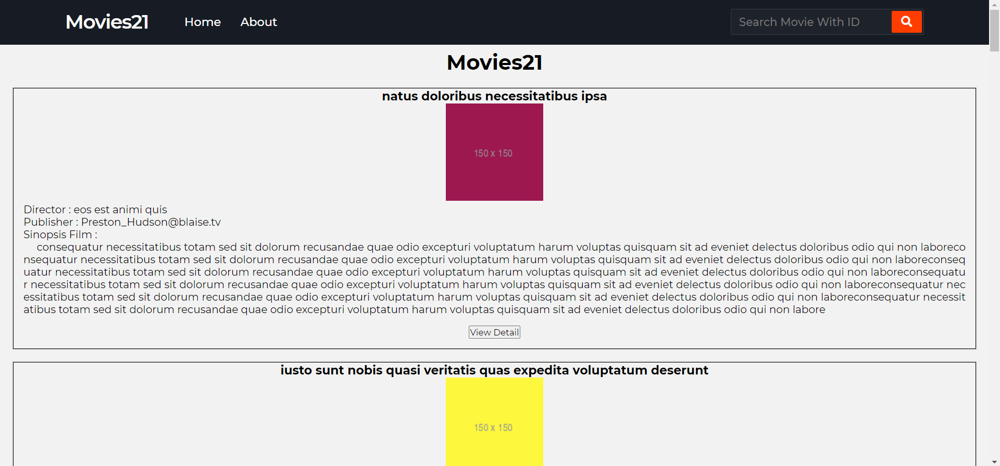
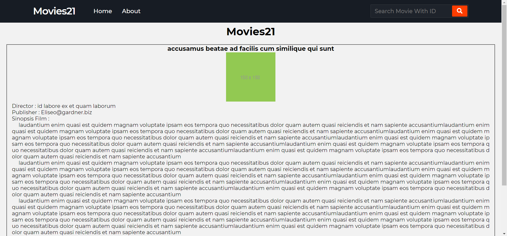
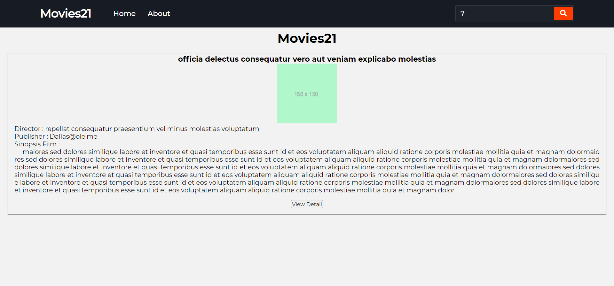
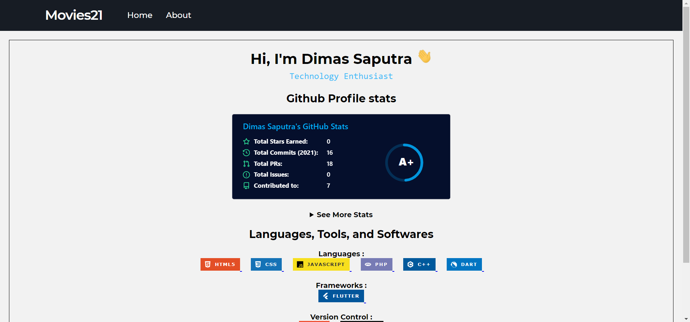

# GDSC-FrontEnd
Repositori ini berisi tentang kode website yang menampilkan beberapa list film dengan properti tiap film yaitu director, publisher, dan sinopsis film. Data properti diambil melalui online rest api JsonPlaceHolder. Pada website ini juga terdapat fitur search bar untuk mencari film berdasaran nomor ID yang tersedia. Pengguna juga dapat melihat detail film menggunakan tombol view detail. Pada halaman about berisi profil singkat.
\
\
Kunjungi halaman [Github pages](https://dimas-saputra-me.github.io/GDSC-FrontEnd/) untuk melihat website. 
\
\
**Jangan lupa star-nya, terima kasih.**
\
**Repositori ini dibuat untuk keperluan tugas FrontEnd GDSC-ITB**

## Website Previews
### Homepage

### Detail Page

### Search Page

### About Page

## Features
- Search movie with available ID
- Using [JsonPlaceHolder API](https://jsonplaceholder.typicode.com/)
- Live Website With [Github pages](https://dimas-saputra-me.github.io/GDSC-FrontEnd/)

## Credits
- Credits Responsive Navbar = https://gist.github.com/safwendr/8e580b9ee0bc7dac4d0d8b7e92656826
- Credits API = https://jsonplaceholder.typicode.com/
- Credits Box Design = https://getcssscan.com/css-box-shadow-examples
